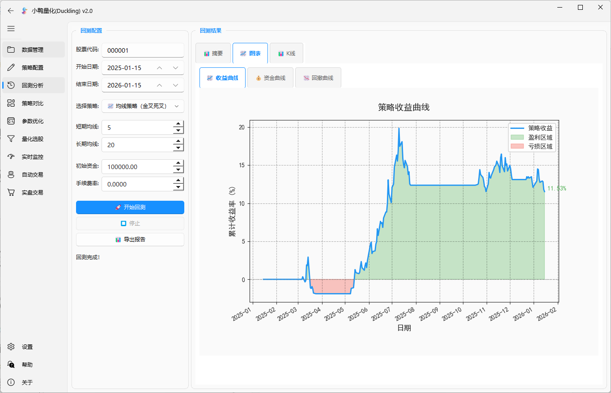
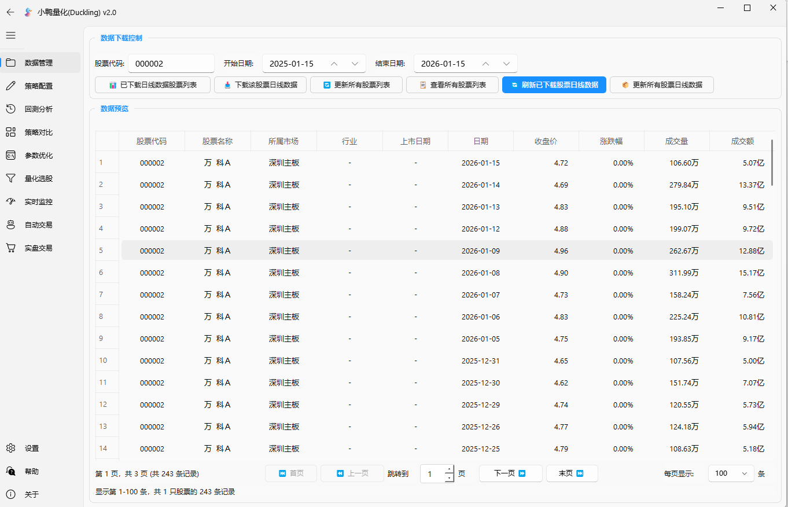
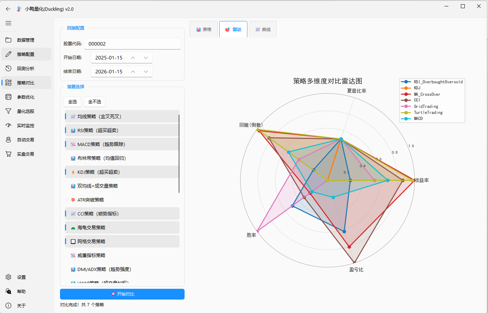
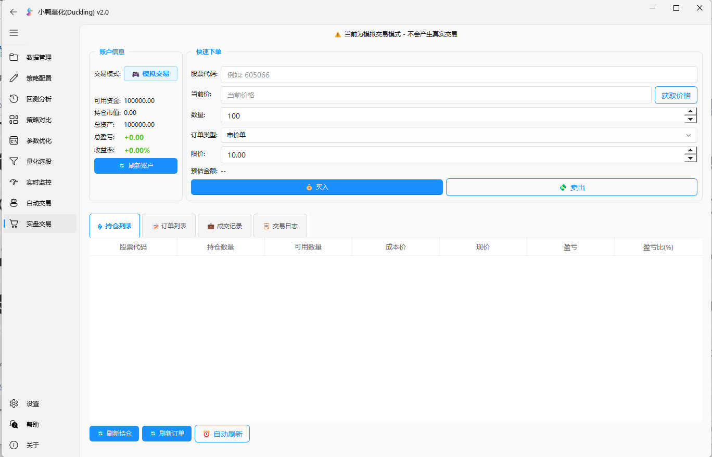

# 🦆 小鸭量化 (Duckling)

<div align="center">


[](https://opensource.org/licenses/Apache-2.0)
[](https://www.python.org/)
[](https://pypi.org/project/PyQt5/)
[]()

**一个功能强大、界面美观的现代化股票量化交易平台**

[特性](#-功能特性) • [安装](#-安装指南) • [使用](#-使用说明) • [截图](#-应用截图) • [下载](#-下载地址) • [贡献](#-贡献指南) • [协议](#-开源协议) • [免责声明](#-免责声明)

</div>

---

## 📖 项目简介

**小鸭量化 (Duckling)** 是一款基于 Python 和 PyQt5 开发的专业级股票量化交易工具。它集成了数据获取、策略开发、回测分析、模拟交易和实盘交易等全流程功能。

采用了 **Fluent Design** 风格的现代化 UI 设计，致力于为量化投资者提供一个优雅、高效、易用的研究与交易平台。

## ✨ 功能特性

### 📊 全面的数据支持
- **多源数据接入**：支持 AkShare、Tushare、Baostock 等主流数据源。
- **本地数据库**：内置 SQLite 数据库，支持数据持久化存储与管理。
- **实时行情**：提供毫秒级实时行情监控。

### 🧠 强大的策略引擎
- **内置策略库**：包含 均线交叉、MACD、布林带、海龟交易、网格交易等 20+ 种经典策略。
- **机器学习集成**：支持 Random Forest、XGBoost、LSTM 等 AI 算法进行股价预测。
- **多因子选股**：内置多因子评分模型，支持自定义因子组合。

### 📈 专业的分析工具
- **回测系统**：基于 Backtrader 的专业级回测引擎，支持多周期、多品种回测。
- **可视化图表**：交互式 K 线图、策略收益曲线、风险指标分析图表。
- **参数优化**：支持网格搜索等参数优化方法，寻找最优策略参数。

### 🖥️ 现代化用户界面
- **Fluent Design**：基于 PyQt-Fluent-Widgets 的精美 UI，支持深色/浅色主题自动切换。
- **响应式布局**：完美适配不同分辨率屏幕。
- **操作便捷**：人性化的交互流程，降低量化入门门槛。

## 🛠️ 技术栈

- **语言**: Python 3.8+
- **GUI 框架**: PyQt5, PyQt-Fluent-Widgets
- **数据处理**: Pandas, NumPy
- **量化核心**: Backtrader, AkShare
- **机器学习**: Scikit-learn, XGBoost, TensorFlow (可选)
- **图表绘制**: Matplotlib, PyQtGraph

## 🚀 安装指南

### 前置要求
确保您的系统已安装 Python 3.8 或更高版本。

### 源码安装

1. **克隆仓库**
   ```bash
   git clone https://github.com/yourusername/duckling.git
   cd duckling
   ```

2. **创建虚拟环境 (推荐)**
   ```bash
   python -m venv venv
   # Windows
   .\venv\Scripts\activate
   # Linux/macOS
   source venv/bin/activate
   ```

3. **安装依赖**
   ```bash
   pip install -r requirements.txt
   ```

## 🎮 使用说明

1. **启动程序**
   ```bash
   python main.py
   ```

2. **首次使用**
   - 程序启动后会自动进入主界面。
   - 建议先在"设置"中配置数据源参数。
   - 首次运行会自动开启 180 天全功能试用模式。

3. **常用功能**
   - **数据下载**：在"数据管理"面板下载历史数据。
   - **策略回测**：在"回测分析"面板选择策略和股票进行回测。
   - **策略开发**：在 `strategies/` 目录下参考示例编写新策略。

## 🖼️ 应用截图

<div align="center">
  
  
  
  
</div>

## 📥 下载地址

最新的打包 EXE 文件可以直接下载使用：
- **Quark Pan**: [点击下载](https://pan.quark.cn/s/0de561b5c86b)

## 🤝 贡献指南

我们非常欢迎并感谢您的贡献！无论是修复 Bug、新增功能还是完善文档。

请阅读 [CONTRIBUTING.md](CONTRIBUTING.md) 了解详细的贡献流程。

1. Fork 本仓库
2. 创建您的特性分支 (`git checkout -b feature/AmazingFeature`)
3. 提交您的修改 (`git commit -m 'Add some AmazingFeature'`)
4. 推送到分支 (`git push origin feature/AmazingFeature`)
5. 开启一个 Pull Request

## 📄 开源协议

本项目采用 **Apache License 2.0** 协议开源。详情请参阅 [LICENSE](LICENSE) 文件。

## ⚠️ 免责声明

股市有风险，交易请谨慎。本软件仅供参考，不构成任何投资建议。
开发者不对因使用本软件产生的任何损失承担责任。

---

<div align="center">
Made with ❤️ by Duckling Team
</div>
